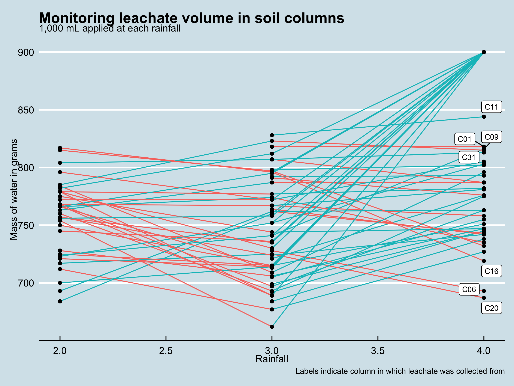

## Abstract

-   Threat of antibiotic resistance
-   Multiple benefits of prairie strips
-   Unknown how strips impact ARGs and manure associated bacteria in runoff
-   Unknown what the difference in abundances of ARGs are between bulk and rhizosphere soils following exposure to nutrient runoff
-   We evaluated ARG presence in soil at 7.5 cm increments from 0 - 65 cm and leachate from soil profiles of two lengths
-   We further characterized soil ARGs and bacteria by separating soil into bulk and rhizosphere components

## Introduction

*Important to characterize background ARGs in soil*

Antibiotics used to treat bacterial infections in humans and livestock prevent ## deaths, however, efficacy of antibiotic treatment is reduced in the presence of antibiotic resistant pathogens. There are currently several approaches being examined to reduce the impact of human activity on environmental ARG presence and abundance. Animal agriculture has been identified as a source and reservoir of antibiotic resistant pathogens, including significant concentrations of ARGs in animal manure. The presence and potential transport of ARGs from manure to surface and groundwater following manure application, reduces the value of animal manures as fertilizers. One approach to reducing ARGs in the environment is to intercept ARGs in water before they are transported to surface or groundwater. Strips of vegetation have been shown to reduce the abundance of ARGs in runoff following simulated rainfall. However, a significant portion of the water cycle is made of infiltrating water and little is known of the impact of vegetative strips on the transport and abundance of ARGs in infiltrating water. 

Antibiotics and antibiotic resistance genes have been detected in organisms and environments regardless of human influence @allen2010. The natural presence of ARGs in soils presents a challenge when evaluating the impact of human activity on ARG abundance. Further, several classes of ARGs are found in native soils as well as in soils associated with agricultural activity @cadena2018.

Evidence suggests that ARGs may be transported through the environment via surface and groundwater movement. For example, manure associated ARGs have been detected up to ?? meters into the soil profile following manure application *CITE*. Further, when rainfall was simulated on plot scale manured soils, significant concentrations of ARGs were detected in the runoff. Supporting the movement of ARGs in water is the observation of little to no ARG accumulation in the soil following manure application *CITE Strips*.

Conservation practices, such as buffers of perennial vegetation, have shown potential to reduce the concentration of ARGs in surface runoff. Yet, little is known of the fate of ARGs introduced to the soil profile of vegetative strips by infiltrating runoff from manured fields.

The concentration of indiginous soil ARGs can range from *BLANK* to *BLANK* copies per gram of soil. In animal manures, from barns utilizing antibioitics, the concentation of ARGs in swine manure ranges from *BLANK* to *BLANK* copies per mL of liquid manure

## Results
-   In the weekly runoff simulations, 1 L of water, averaged 750 mL of water collected as leachate (Fig 1). 

Figure 1 

-   We observed differences in infiltration rate between columns, with several columns showing ponding of water before draining. In addition, several columns began dripping leachate within 10 to 15 minutes. Average time to apply 1 L of DI water was 20 minutes and leachate was collected until > 30 seconds between drips. 
-   Soil health and characteristics of field site

-   ASVs

    -   The mean number of ASVs (richness) was greater in \_\_\_ soil than \_\_\_ soil
    -   Community structure varies by \_\_\_
    -   The difference in community structure between bulk and rhizosphere prairie soils is characterized by \_\_\_
    -   

-   ARGs

## Conclusion

## Materials and Methods

-   Field site

    -   Prairie strips installed in 20XX

    -   Soil is \_\_\_

    -   Mean annual precipitation

    -   Column sample locations

    -   Column collection

        -   Three blocks

        -   baseline soil health

            -   Composite of 10 cores taken between two adjacent column sample locations (0 - 6")

        -   baseline DNA

            -   One core taken adjacent to each soil column, (0 - XX cm (full probe))

-   Column design

    -   6 " diameter PVC cut to 35 or 65 cm long

    -   Bevel cut along bottom edge and two cotter pin holes drilled opposite of each other \~ inches from top of column

    -   PVC cap with hole and steel screen, filled with sand used to cap bottom of column

-   Laboratory setup

-   Simulated rainfalls

-   Simulated nutrient runoff

-   Leachate collection

-   Soil collection

    -   

    -   Separation of bulk vs. rhizosphere

## Acknowledgments

## References
