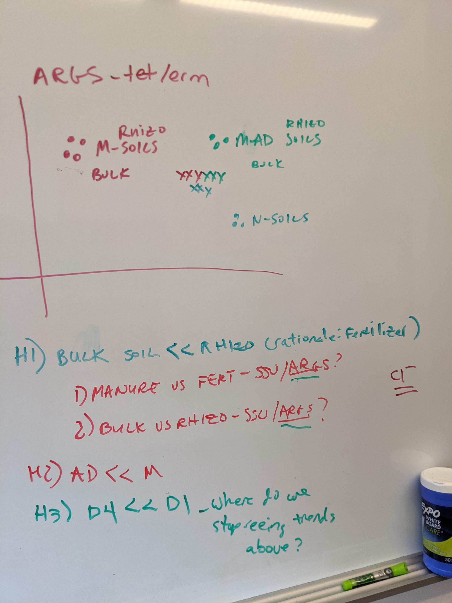

# Hypothesis development

For Jared's first paper, there are three hypotheses:

## H1

*The composition of taxa (16S) and ARGs is different between bulk and rhizosphere soil following fertilizer or manure applications*

## H2

*AD swine manure runoff induces smaller shifts in 16S and ARGs in soil when compared to M runoff, but both AD and M elicit greater responses than mineral runoff*

## H3

*With greater soil depth, there is less dissimilarity between bulk and rhizo 16S and ARG communities*

{width="317"}

# Rationale

## H1

*Bulk vs. rhizosphere impact on SSU/ARGs*

First, there is strong evidence for different bacterial community compositions between bulk and rhizosphere soils [@kuzyakov2015]. In prairies, similar differences between bulk and rhizosphere soils has been observed, however, it must be noted that restored prairies can take decades before soil microbiomes are "mature" [@allison2005].

In general, bulk soil is more/less taxonomically diverse than rhizosphere soil and has lower/higher bacterial abundances. Fertilization and manure introduce nutrients and influence the abundance of ARGs. **In a pot study, manured soils had higher relative abundance of ARGs in bulk soil than in rhizosphere soil but the absolute abundance of ARGs (copies per gram of soil) was lower in bulk soil than most rhizosphere soils** [@song2020].

*Manure vs. fertilizer impact on SSU/ARGs*

Inputs of nutrients into soil increase the bacterial biomass, inherently increasing the number of indigenous resistance genes. **To properly quantify the impact of manure, profiles of manure associated genes should be developed and screened for in soil and water samples.**

# Questions to answer

1.  What is the absolute number of ARGs in M and ADM?
2.  Relative abundance of ARGs in runoff water and leachate?
3.  Resistome in baseline soils?
4.  How do numbers of ARGs change in leachate compared to runoff? How do ARGs change in soil following nutrient runoff?
5.  What is the difference in ARG response between rhizosphere and bulk soil?
6.  Is the response different based on treatment?
7.  What are the differences in persistence of stimulated ARGs between bulk and rhizosphere communities?

# Bibliography
